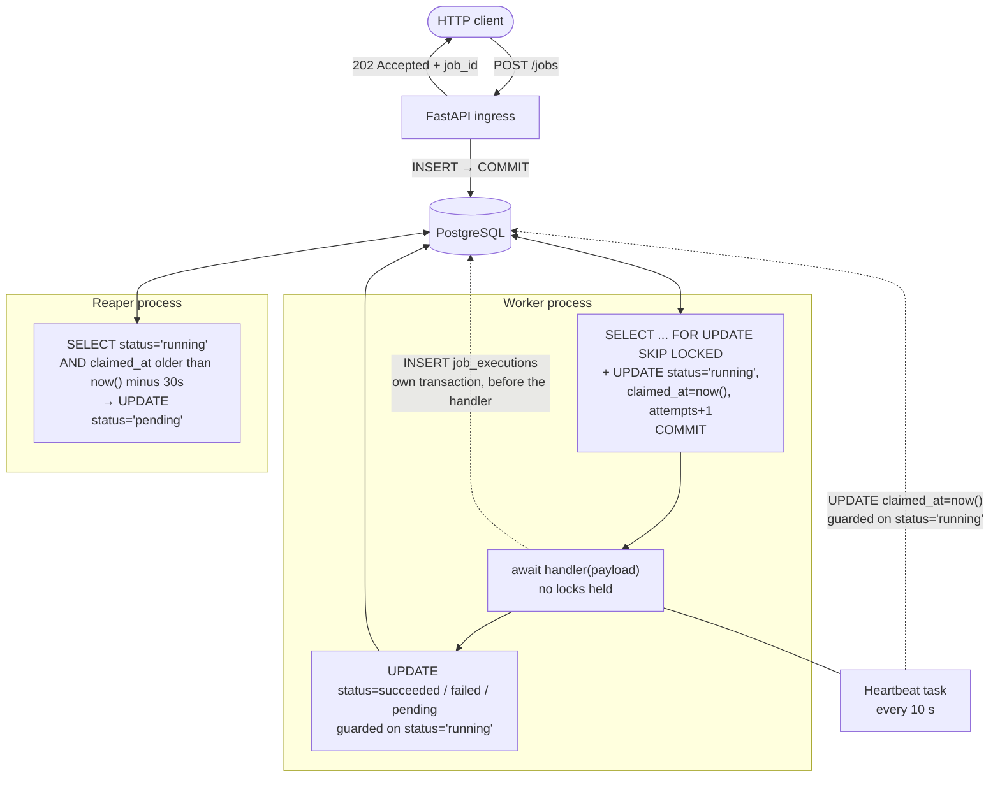
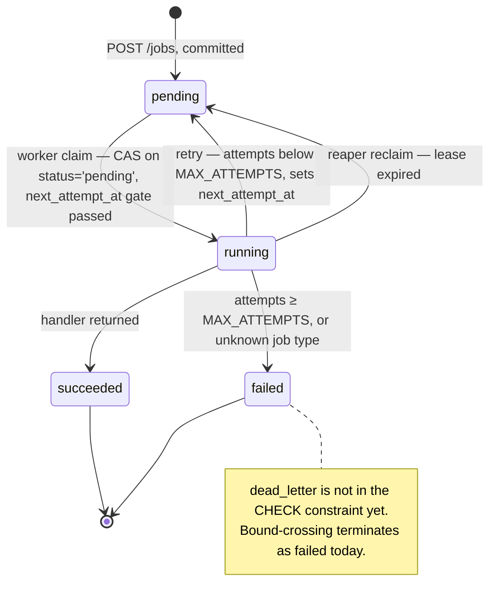

# Relay

**A durable background-job execution engine built on PostgreSQL transactional primitives.**

[](https://www.python.org/downloads/)
[](https://fastapi.tiangolo.com)
[](https://www.postgresql.org)
[](https://www.sqlalchemy.org)
[](https://alembic.sqlalchemy.org)
[](#license)

> **No Redis. No RabbitMQ. No Celery.** One relational table, atomic state transitions, and every
> reliability claim backed by a measurement that is written down.

Relay is a learning-in-public systems project. The queue itself is deliberately small; what the repository
actually contains is **the evidence trail** — every design decision with the cost of the road not taken, and
every failure mode reproduced, measured, and recorded before it was mitigated.

---

## Table of contents

- [What is actually built](#what-is-actually-built)
- [Design contract](#design-contract)
- [Architecture](#architecture)
- [State machine](#state-machine)
- [The claim, in one query](#the-claim-in-one-query)
- [Quickstart](#quickstart)
- [API](#api)
- [Schema](#schema)
- [Architectural decisions](#architectural-decisions)
- [Measured failure modes](#measured-failure-modes)
- [Known limits](#known-limits)
- [Roadmap](#roadmap)
- [Repository layout](#repository-layout)
- [How this repo is written](#how-this-repo-is-written)
- [License](#license)

---

## What is actually built

Status is per-mechanism, not per-week, and it distinguishes **shipped** from **measured**. A mechanism can be
correct and unproven; this table refuses to conflate the two.

| Mechanism | Shipped | Measured evidence |
|:---|:---:|:---|
| Durable ingress — `POST /jobs` commits before `202` | ✅ | Row survives API kill between commit and response |
| Two-part claim — `FOR UPDATE SKIP LOCKED` + compare-and-set | ✅ | Concurrent claim returns `rowcount = 0`; no double-claim observed |
| Handler registry, decoupled from row locks | ✅ | Zero `idle in transaction` during handler execution |
| Finish-current graceful shutdown | ✅ | Exit code `0`; no new claim after the signal |
| Payload size bound at ingress | ✅ | `413` before the body is buffered — and see [Known limits](#known-limits) |
| `job_executions` append-only instrument | ✅ | Every dispatch recorded, in the database's own clock |
| Worker lease (`claimed_at` + 30 s) | ✅ | Reclaim latency bounded by `lease + one reaper period`: **1.798 s** |
| Reaper process — reclaims expired leases | ✅ | `running → pending` on expiry; terminal rows untouched |
| Worker heartbeat (10 s) | ✅ | Lease pushed **40.295 s** past dispatch on a 45 s handler; **narrows** the duplicate window, does not close it |
| Bounded retry + exponential backoff + jitter | ✅ | 3 dispatches, inter-attempt gaps **4.07 s → 6.10 s**, execution count frozen at the bound while the worker stayed alive |
| Dead-letter queue (`dead_letter` status) | 🔜 | Bound-crossing currently terminates as `failed` |
| Idempotency / deduplication | 🔜 | Duplicate execution is **reproduced and measured** — see below |
| Fencing tokens | 🔜 | The gap is measured; the fix is deliberately deferred |

---

## Design contract

Five invariants. Each one is a claim the repository is expected to defend with output, not prose.

| Invariant | Current standing |
|:---|:---|
| **Durability** — an accepted job is never silently lost | Enforced. `COMMIT` precedes `202 Accepted`; nothing lives in process memory |
| **At-least-once execution** — crashes are recoverable | Enforced by lease + reaper. The cost is duplicate execution, which is measured rather than assumed away |
| **Bounded retries** — failure does not become an infinite loop | Enforced. `attempts` increments inside the claim's own transaction, so the counter advances even when the failing worker never reports |
| **Terminal failures are visible** — nothing disappears quietly | Partial. Bound-crossing is terminal today; a distinct `dead_letter` name is next |
| **Clean transaction boundaries** — no I/O under a row lock | Enforced. The claim commits before the handler runs |

**What Relay does not claim:** exactly-once execution. A lease can expire while a healthy handler is still
running, and the reaper cannot distinguish a slow worker from a dead one. That is measured, not theoretical
— see [Measured failure modes](#measured-failure-modes).

---

## Architecture

Three independent processes, one table, no broker.



**Why the handler runs outside the transaction.** The claim commits first, so no Postgres row lock is held
while arbitrary user code runs. A slow handler cannot starve the connection pool or leave an
`idle in transaction` session holding locks — a hazard this project reproduced and recorded before designing
around it.

**Why `job_executions` exists.** `jobs.status` records *where a job is*, never *how many times it ran*. An
append-only row per dispatch is the only instrument that can prove duplicate execution after the fact, and it
is written in the **database's** clock so timing arithmetic needs zero conversions.

---

## State machine

Every transition is a guarded `UPDATE`. There is no state machine object; the guard **is** the state machine.



**Two things worth reading twice.**

`running → pending` has **two** distinct causes — a retry and a lease reclaim — and `status` alone cannot
tell them apart. Recovering *cause* from *state* requires a column the schema does not have; that limitation
is documented rather than papered over.

`dead_letter` is **not** in the `CHECK` constraint yet. The bound is enforced today and the terminal state is
named `failed`; giving the stop its own name is the next change. The split is deliberate — enforcing a bound
and naming its outcome are two different pieces of work with two different failure modes.

Backoff and jitter, verbatim from `src/worker.py`:

```python
MAX_ATTEMPTS          = 3
BASE_BACKOFF_SECONDS  = 3.0
BACKOFF_MULTIPLIER    = 2.0
BACKOFF_CAP_SECONDS   = 15.0   # currently inert: first binds at attempt 4

delay  = min(BASE_BACKOFF_SECONDS * BACKOFF_MULTIPLIER ** (attempt - 1), BACKOFF_CAP_SECONDS)
actual = delay / 2.0 + random.uniform(0, delay / 2.0)   # equal jitter
```

---

## The claim, in one query

Two halves, doing two different jobs. Neither is redundant.

```python
select(Job.id, Job.type, Job.payload, Job.attempts)
    .where(
        Job.status == "pending",
        or_(Job.next_attempt_at.is_(None),          # never retried
            Job.next_attempt_at <= func.now()),     # backoff elapsed
    )
    .order_by(Job.created_at, Job.id)
    .limit(1)
    .with_for_update(skip_locked=True)              # half 1: don't queue behind a peer
```

```python
update(Job)
    .where(Job.id == job.id, Job.status == "pending")   # half 2: compare-and-set
    .values(status="running",
            claimed_at=func.now(),
            attempts=Job.attempts + 1)                   # column expression, not read-modify-write
```

- `SKIP LOCKED` stops two workers from **serialising** on the same row.
- The `status = 'pending'` guard stops them from both **succeeding** on it. `rowcount == 0` means a peer or
  the reaper got there first, and the worker yields instead of clobbering state.
- `attempts=Job.attempts + 1` is a **column expression** — the arithmetic happens inside the `UPDATE`'s row
  lock. A Python read-modify-write here would be a textbook lost update.
- The `IS NULL` branch is mandatory: `NULL <= now()` evaluates to `NULL`, and `WHERE NULL` excludes the row.
  Without it, every pre-existing row becomes permanently unclaimable — silently, with no error.

---

## Quickstart

**Requirements:** Python 3.13+, Docker.

```bash
git clone <repo-url> relay && cd relay

python -m venv .venv
# Windows:  .venv\Scripts\Activate.ps1
# Unix:     source .venv/bin/activate
pip install -r requirements.txt

cp .env.example .env          # DATABASE_URL points at localhost:5433
docker compose up -d          # PostgreSQL 16 on host port 5433
alembic upgrade head
```

Run the three processes in separate terminals:

```bash
uvicorn src.main:app --reload      # API      → http://127.0.0.1:8000
python -u -m src.worker            # worker   → claims, executes, marks
python -u -m src.reaper            # reaper   → reclaims expired leases
```

> `-u` is not optional when you care about the output. Without unbuffered stdout, *"the handler never
> finished"* and *"the line was never flushed"* produce identical logs.

**Enqueue and inspect:**

```bash
curl -X POST http://127.0.0.1:8000/jobs \
  -H 'Content-Type: application/json' \
  -d '{"type":"sleep","payload":{}}'
# → 202 {"job_id": 1, "status": "pending"}

curl http://127.0.0.1:8000/jobs/1
# → 200 {"job_id": 1, "status": "succeeded"}
```

<details>
<summary>PowerShell equivalents</summary>

```powershell
Invoke-RestMethod -Method Post -Uri http://127.0.0.1:8000/jobs `
  -ContentType application/json `
  -Body '{"type":"sleep","payload":{}}'

Invoke-RestMethod http://127.0.0.1:8000/jobs/1
```
</details>

**Watch the machinery work.** `boom` fails unconditionally, so it exercises the whole retry policy:

```bash
curl -X POST http://127.0.0.1:8000/jobs -H 'Content-Type: application/json' \
     -d '{"type":"boom","payload":{}}'
```

```sql
-- three dispatches, growing gaps, then terminal
SELECT job_id, worker_id, executed_at,
       executed_at - lag(executed_at) OVER (PARTITION BY job_id ORDER BY executed_at) AS gap
  FROM job_executions WHERE job_id = <id> ORDER BY executed_at;

SELECT id, status, attempts FROM jobs WHERE id = <id>;
```

Built-in handlers: `sleep` (2 s), `slow` (8 s), `boom` (raises immediately).
An unregistered `type` is marked `failed` with **no** execution row — dispatch never happened.

---

## API

| Method | Path | Response | Notes |
|:---|:---|:---|:---|
| `GET` | `/health` | `200 {"ok": true}` | Liveness. Touches no database |
| `GET` | `/db-ping` | `200 {"db": 1}` | Readiness. Round-trips a real query |
| `POST` | `/jobs` | `202 {"job_id", "status"}` | Committed before responding |
| `GET` | `/jobs/{id}` | `200 {"job_id", "status"}` · `404` | |

`POST /jobs` body: `type` is a non-blank string, 1–100 chars, whitespace-trimmed. `payload` is a JSON object,
defaulting to `{}`. Oversized requests are rejected with `413` before the body is read.

**`202` is the honest status code, and it has a limit.** It promises the job is durable, not that it
succeeded. It also cannot promise the *caller* ever learns the `job_id` — the response can be lost after the
commit, which is precisely why idempotency keys are on the roadmap rather than assumed.

---

## Schema

```sql
CREATE TABLE jobs (
    id              bigserial    PRIMARY KEY,
    type            text         NOT NULL,
    payload         jsonb        NOT NULL DEFAULT '{}'::jsonb,
    status          text         NOT NULL DEFAULT 'pending',
    attempts        integer      NOT NULL DEFAULT 0,
    created_at      timestamptz  NOT NULL DEFAULT now(),
    claimed_at      timestamptz,          -- lease start; NULL = not held
    next_attempt_at timestamptz,          -- backoff not-before; NULL = claim immediately
    CONSTRAINT jobs_status_check
        CHECK (status IN ('pending','running','succeeded','failed'))
);

CREATE TABLE job_executions (            -- append-only instrument
    id          bigserial    PRIMARY KEY,
    job_id      bigint       NOT NULL,   -- intentionally no FK
    worker_id   text         NOT NULL,
    executed_at timestamptz  NOT NULL DEFAULT now()
);
```

`job_executions` has **no foreign key and no index**, on purpose. It is an observation log, not a relation:
it must survive anything that happens to `jobs`, and adding an index before a query plan justifies it is
tuning without a measurement.

`executed_at` is a **dispatch** instant, written before the handler body runs. There is no completion
timestamp, so `count(*) > 1` proves a job was dispatched twice and says nothing about whether the executions
overlapped. Proving overlap needs a second endpoint from somewhere else — which is exactly how the duplicate
below was established.

---

## Architectural decisions

Full rationale, with the cost of every rejected option, in [`docs/DECISIONS.md`](docs/DECISIONS.md).

| Area | Choice | Why, and what it costs |
|:---|:---|:---|
| **Queue substrate** | PostgreSQL, not Redis / RabbitMQ | One `COMMIT` gives ingress durability with no second system to keep consistent. Costs throughput ceiling and puts queue load on the primary |
| **Job identity** | DB-generated `bigint` | Ordering and identity stay the database's job. Client-supplied idempotency becomes a separate column with separate semantics, instead of being smuggled into the primary key |
| **Status domain** | `text` + `CHECK` | Postgres enums have no `DROP VALUE` and add migration hazards. A `CHECK` swap is explicit and reversible-in-shape. Costs a full-table validation on change, mitigated with `NOT VALID` + `VALIDATE CONSTRAINT` |
| **Transition safety** | Compare-and-set, not schema | The `CHECK` constrains the *set* of values; only a guarded `UPDATE` constrains the *transitions*. Neither substitutes for the other |
| **`payload`** | `jsonb NOT NULL DEFAULT '{}'` | Absent and empty payloads stop being two different states. Costs schema-level validation of contents |
| **Lease representation** | `claimed_at` + a constant, not `lease_expires_at` | An **event** column, so the duration lives in the reaper's predicate and can be changed without rewriting rows. Costs: the predicate must carry the arithmetic, and the column now means three things |
| **`attempts` increment** | On **claim**, not on failure | The claim already committed, so the counter advances even when the failing worker is dead. Costs: it counts *dispatches*, so a lease reclaim spends retry budget without a single failure |
| **Backoff not-before** | Dedicated `next_attempt_at` column | Keeps `claimed_at`'s meaning intact and the claim query simple. Costs a column, a migration, and a mandatory `IS NULL` branch |
| **Ingress bound** | `Content-Length` middleware | Rejects before the body is buffered or parsed. Costs: the header is sender-controlled — see [Known limits](#known-limits) |
| **Shutdown** | Finish-current, flag checked at loop top | No abandoned in-flight rows on a clean exit, exit code `0`. Costs: shutdown latency is bounded by the slowest handler, and Relay does not bound handlers |

---

## Measured failure modes

Every entry in [`docs/PROBLEMS.md`](docs/PROBLEMS.md) was reproduced before it was reasoned about. A
selection, with the numbers that make them real:

**Duplicate execution is real, and both executions were legitimate.**
A 45 s handler under a 30 s lease. Worker A dispatched at `10:28:27.762549+00`; the reaper reclaimed the
expired lease `207 ms` after expiry; worker B dispatched the **same job** at `10:28:58.005919+00`. Overlap:
**14.783 s**, derived entirely in the database's clock. Every compare-and-set was correct at the instant it
ran. Worker A's completion mark returned `rowcount = 1` on work worker B was still executing — because the
guard asks whether `status` **is** `'running'`, never *whose*. That is the fencing-token argument, arrived at
by measurement instead of by reading.

**A heartbeat narrows the window and cannot close it.**
Same handler shape, heartbeat on: 4 heartbeats pushed `claimed_at` **40.295 s** past dispatch, the lease
never expired, one execution row. It works because `await asyncio.sleep` yields. A CPU-bound handler, a
blocking driver, or a process pause yields nothing and sends no heartbeat — so the heartbeat's coverage is
**inversely** correlated with the severity of the failure a lease exists to catch.

**A latency number can be arithmetically perfect and measure the wrong thing.**
Reclaim latency was first reported as `19.95 s`. Both timestamps were real, both in UTC, the subtraction was
right. The real number is **1.798 s** — the difference is that the reaper was started *after* the row
expired, so the original number measured operator reaction time. The observer's start time is part of the
measurement.

**The observation quantum is part of the policy.**
The worker polls every 2.0 s. Equal jitter on a 3.0 s base gives a first-retry range of `[1.50, 3.00]` — and
the floor is *below* the poll interval, so a third of the range is invisible in the data. Four jobs failing
together produced an apparent 2.115 s "spread" that was actually **two poll ticks**, with the jobs clustered
33–69 ms apart inside a tick — *tighter* than the un-jittered round. The convoy jitter was added to prevent
had re-formed. Jitter narrower than the sampling interval is erased before it can be measured.

**A verification step can pass while the mechanism it tests is absent.**
An oversized-payload check returned `413` against a limit that protected nothing, because the body was
already buffered and parsed before the check ran. One request could not tell a working limit from a broken
one; three differential requests could. Every verification step in this repo is now written by asking *what
wrong implementation would also pass this?*

---

## Known limits

Stated plainly, because a mitigation described as an elimination is worse than no mitigation.

| Limit | Status |
|:---|:---|
| **Duplicate execution is possible.** A lease can expire under a healthy handler | Reproduced and measured. Idempotency is Week 3 |
| **The compare-and-set guard cannot distinguish lease generations.** `running → pending → running` is a cycle, and a predicate on `status` has no vocabulary for *"still the same claim"* | Measured on three separate statements. Fencing tokens are deliberately deferred |
| **The payload bound trusts a sender-controlled header.** A missing or lying `Content-Length` bypasses it | Known. A read-side byte cap is the real fix |
| **`running → pending` has two causes and the schema records neither.** Retry and reclaim are indistinguishable after the fact | Documented. Needs a cause column, not a status value |
| **A retry-waiting row is indistinguishable from a stuck row in `psql`.** `MAX_ATTEMPTS` is a Python constant, not a database value | Partly addressed by making bound-crossing terminal; fully addressed when `dead_letter` lands |
| **Shutdown latency is unbounded**, because handler duration is unbounded | Handler timeout and lease duration are one decision, not two, and it is not made yet |
| **No index on `jobs`** beyond the primary key. The claim query orders by `(created_at, id)` | Deliberate. Indexing before an `EXPLAIN ANALYZE` is tuning without a measurement — Week 4 |
| **Single-tenant, no auth, no rate limiting.** The API is unauthenticated | Out of scope by design. Do not expose this to a network you do not control |

---

## Roadmap

- [x] **Week 1 — Core engine**
  - [x] Durable `jobs` schema, Alembic migration chain
  - [x] `POST /jobs` (`202`) and `GET /jobs/{id}`
  - [x] Two-part claim: `FOR UPDATE SKIP LOCKED` + compare-and-set
  - [x] Handler registry, execution decoupled from row locks
  - [x] Finish-current graceful shutdown
  - [x] `job_executions` instrument table
- [ ] **Week 2 — Crash resilience & recovery**
  - [x] Worker lease (`claimed_at` + 30 s)
  - [x] Reaper process, guarded `running → pending` reclaim
  - [x] Worker heartbeat, and its measured limits
  - [x] Bounded retry, exponential backoff, equal jitter
  - [ ] `dead_letter` status via `NOT VALID` + `VALIDATE CONSTRAINT`
  - [ ] Mid-job shutdown versus lease expiry
- [ ] **Week 3 — Toward exactly-once effects**
  - [ ] Idempotency keys and request deduplication
  - [ ] Side-effect isolation, property-tested against the measured duplicate
- [ ] **Week 4 — Hardening**
  - [ ] `EXPLAIN ANALYZE`-driven indexing
  - [ ] Rate limiting, load testing, metrics

---

## Repository layout

```text
src/
├── main.py         FastAPI endpoints and app wiring
├── worker.py       claim → execute → mark loop, heartbeat, retry policy, signals
├── reaper.py       lease-expiry reclaim loop, guarded transitions
├── models.py       SQLAlchemy 2.0 declarative models and constraints
├── schemas.py      Pydantic v2 request/response contracts
├── database.py     async engine, session factory, DI dependency
└── middleware.py   ingress payload size bound

alembic/versions/   migration chain (one revision is intentionally empty — see the log)
labs/               standalone experiments: pooling, timeouts, signals, seeding

docs/
├── DECISIONS.md    architecture decisions, every one with its Cost field filled
├── PROBLEMS.md     reproduced failure modes with the measurements attached
├── POSTMORTEMS.md  others' incidents, and one of my own
├── LEARNING_LOG.md master index into the weekly logs
├── logs/           what actually happened each day, with honest self-scores
├── planning/       what was intended, written before the week started
└── roadmap/        long-range reference
```

`docs/planning/` states intent; `docs/logs/` states outcome. They are never the same file, so *"did the
original goal get met?"* stays answerable six months later.

---

## How this repo is written

Three rules that shape everything above.

**Every measurement is labelled `[MEASURED]` or `[INFERRED]`.** *"Not recorded"* is written where a value is
unknown, instead of a plausible number. Wrong predictions stay in the logs, including wrong predictions made
during review.

**No mitigation is described as an elimination.** `narrows`, not `closes`. `reduces`, not `zero`. The
heartbeat section above is the canonical example: it works, its coverage is inverse to the severity of the
failure it addresses, and both halves are stated.

**A verification step must be able to fail.** For each check: *what wrong implementation would also pass
this?* If the answer is "a broken one", the check is decorative and gets rewritten as a differential.

---

## License

MIT.

> The badge above points here rather than to a file, because a `LICENSE` file has not been added yet. Drop a
> standard MIT `LICENSE` with your name and year at the repository root, then point the badge at it.