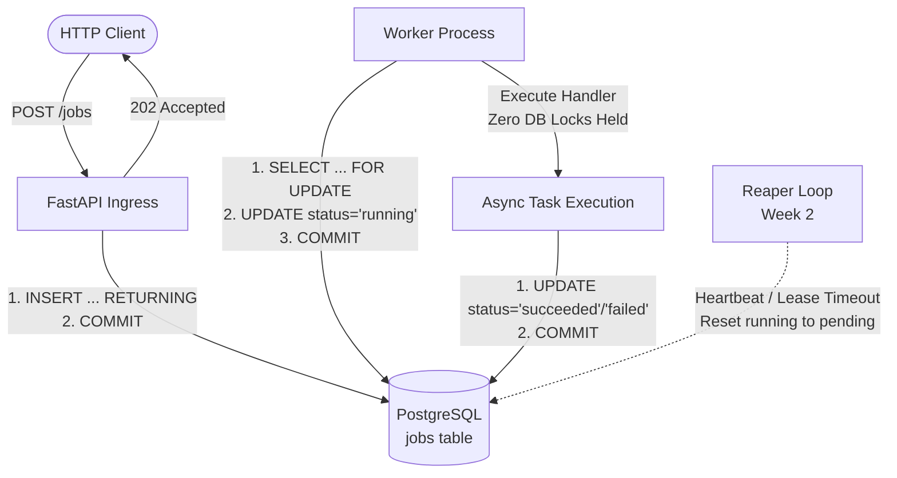
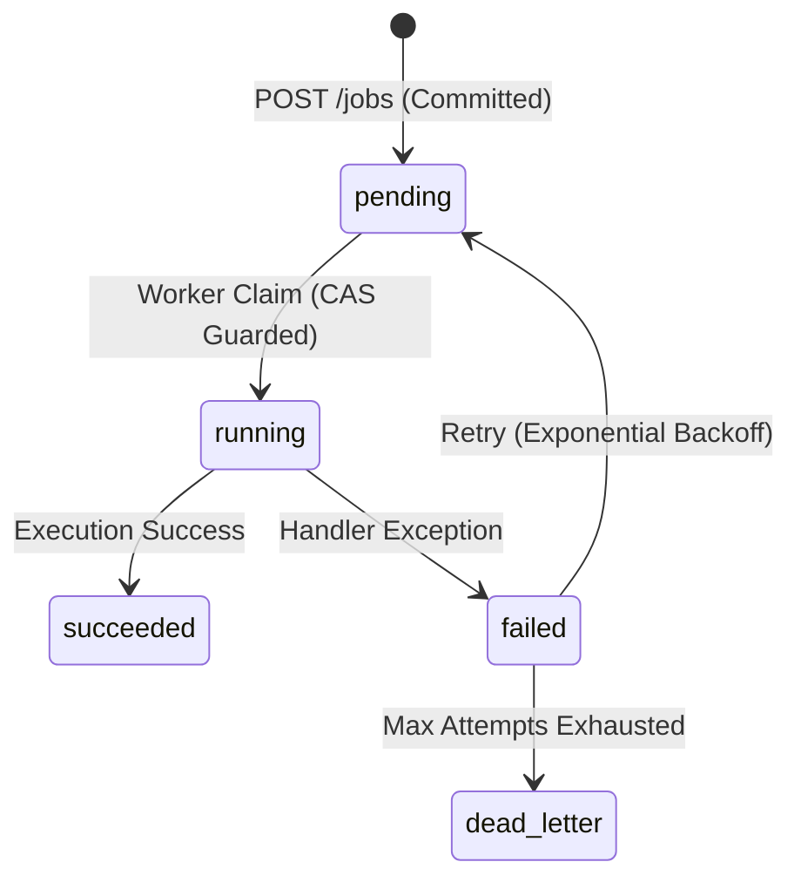

# Relay

[](https://www.python.org/downloads/)
[](https://fastapi.tiangolo.com)
[](https://www.postgresql.org)
[](https://www.sqlalchemy.org)
[](LICENSE)

A durable, crash-resilient distributed background job execution engine built on top of **PostgreSQL transactional primitives**. 

> **Zero Redis. Zero RabbitMQ. Zero Celery.**
> One relational table, atomic state transitions, and strict durability guarantees.

---

## 🎯 The Core Contract

Relay is designed around five non-negotiable distributed execution invariants:

* **Durability First:** An accepted job is never lost across API crashes, DB restarts, or worker failures.
* **At-Least-Once Execution:** Jobs surviving node/process crashes are guaranteed to be recovered and executed.
* **Bounded Retries & DLQ:** Transient failures retry with backoff; exhausted attempts route to Dead Letter Queue.
* **Deterministic Traceability:** Exact state and lifecycle stage is queryable in real-time.
* **Clean Transaction Boundaries:** Non-database execution I/O is decoupled from row locks to prevent connection starvation.

---

## 📐 Architecture & Flow



---

## 🔄 State Machine

Every state transition is enforced via **atomic Compare-and-Set (CAS)**:



#### Guarded Atomic Transition Primitive
```sql
UPDATE jobs 
SET status = 'running' 
WHERE id = $1 AND status = 'pending';
```
> If `rowcount == 0`, a concurrent writer or lease reaper modified the state first. The worker yields immediately without clobbering external state.

---

## ⚡ Quickstart

### 1. Start Infrastructure & App
```bash
# Start PostgreSQL container
docker compose up -d

# Run database migrations
alembic upgrade head

# Terminal 1: Start API Server
uvicorn src.main:app --reload

# Terminal 2: Start Worker Process
python -m src.worker
```

### 2. Enqueue & Inspect Jobs
```powershell
# Enqueue a background job
Invoke-RestMethod -Method Post -Uri http://127.0.0.1:8000/jobs `
  -ContentType application/json `
  -Body '{"type":"sleep","payload":{}}'

# Query job execution status
Invoke-RestMethod http://127.0.0.1:8000/jobs/1
```

---

## 🛠️ Key Architectural Decisions

Comprehensive rationale and trade-offs documented in [`docs/DECISIONS.md`](docs/DECISIONS.md).

| Component | Design Choice | Systems Rationale |
|---|---|---|
| **Storage Engine** | PostgreSQL (`jobs` table) | Native ACID durability; `COMMIT` guarantees zero-loss ingress without an external broker. |
| **Identity Model** | DB-generated `bigint` | Primary Key and future Idempotency Keys are decoupled into separate concerns. |
| **Status Domain** | `TEXT` + `CHECK` constraint | Avoids Postgres enum `DROP VALUE` lock hazards and migration incompatibilities. |
| **Ingress Bounds** | HTTP Middleware byte bound | Drops oversized requests before reading/parsing body into application memory. |
| **Lock Discipline** | Claim commit before handler | Decouples execution latency from Postgres row locks, eliminating `idle in transaction` hazards. |
| **Signal Handling** | Custom `SIGINT`/`SIGTERM` hooks | Enforces *finish-current* graceful shutdown (exit code 0) without leaving abandoned in-flight rows. |

---

## 🗺️ Project Roadmap

- [x] **Week 1: Core Engine**
  - Durable `jobs` schema & migrations
  - `POST /jobs` (202 Accepted) and `GET /jobs/{id}` endpoints
  - Single-transaction claim query (`SELECT FOR UPDATE` + CAS guard)
  - Decoupled worker loop & dynamic Handler Registry
  - Finish-current graceful shutdown lifecycle
- [ ] **Week 2: Crash Resilience & Recovery**
  - Worker leases, heartbeats & background Reaper process
  - Bounded exponential retries & Dead Letter Queue (`dead_letter`)
- [ ] **Week 3: Exactly-Once Processing**
  - Idempotency keys, request deduplication, side-effect isolation
- [ ] **Week 4: Production Hardening & Benchmarking**
  - `EXPLAIN ANALYZE` index tuning, stream rate-limiting, load testing

---

## 📁 Repository Layout

```text
src/
├── main.py        # FastAPI endpoints (POST /jobs, GET /jobs/{id})
├── worker.py      # Worker polling, claim-execute-mark loop, signal handling
├── models.py      # SQLAlchemy declarative models & schema constraints
├── schemas.py     # Pydantic v2 validation contracts
├── database.py    # Asyncpg connection pooling & engine configuration
└── middleware.py  # Ingress payload size-limiting middleware
alembic/           # Schema migration revisions
docs/              # Architecture Decision Records (ADRs) & empirical logs
```

---

## 📄 License
MIT